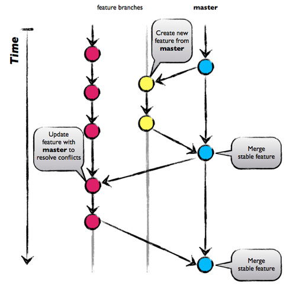

# Git

## SSH

###### Générer une nouvelle clé SSH (PEM format)
```shell
ssh-keygen -t rsa -C "your.email@example.com" -b 4096
```

###### ~/.ssh/config example:
```config
# Global SSH configurations here will be applied to all hosts
# IdentityFile ~/.ssh/id_rsa

Host github.com
    IdentityFile ~/.ssh/id_sgalopin_github

Host gitlab.dockerforge.ign.fr
    IdentityFile ~/.ssh/id_sgalopin_gitlab
```
###### git config example:

```shell
git config -l
git config user.name "myname"
git config user.email "myemail"
```

Sources:
- [Generating a new SSH key and adding it to the ssh-agent](https://help.github.com/articles/generating-a-new-ssh-key-and-adding-it-to-the-ssh-agent/)
- [ssh-add add all private keys in .ssh directory](https://unix.stackexchange.com/questions/322124/ssh-add-add-all-private-keys-in-ssh-directory)
- [Set git email address on a per repository basis](https://dereenigne.org/git/set-git-email-address-on-a-per-repository-basis/)

## Merge d'une branche de recette

### Merge sur master
```git
git fetch origin
git checkout Release_Vx.x.x
git pull
git checkout master
git pull
git merge --no-ff -m "Merge version x.x.x" Release_Vx.x.x
git tag -a vx.x.x -m "Version x.x.x" HEAD
git push --tags origin master
```

### Merge sur develop
```git
- git fetch origin
- git checkout Release_Vx.x.x
- git pull
- git checkout develop
- git pull
- git merge --no-ff -m "Merge version x.x.x" Release_Vx.x.x
- git push origin develop
```
## Supprimer une branche (locale ou distante)
### Locale
```git
git branch -d the_local_branch
```
### Distante
```git
# Ancienne syntaxe
git push origin :the_remote_branch
# Nouvelle syntaxe
git push origin --delete the_remote_branch
```
### Mise à jour des branches distantes en local
```git
git fetch -p
```
Sources:
- [Git: Delete a branch (local or remote)](https://makandracards.com/makandra/621-git-delete-a-branch-local-or-remote)

## Renommer une branche sur GitHub.com
Déprotéger la branche old-name pour permettre sa suppression lors du push.
Changer la branche par défaut si la branche old-name l'est, pour permettre sa suppression lors du push.
```git
git branch -m old-name new-name
git push origin :old-name new-name
```
Définir la branche comme branche par défaut si nécessaire.
Protéger la branche si nécessaire.

## Migrer un dépôt SVN vers un dépôt Git

- [Exemple de fichier de migration](svntogit.txt)
- [Exemple de fichier utilisateurs](users.txt)

## Workflow
### GitHub-Flow (Scott Chacon)

### Git-Flow (Vincent Driessen)


Sources:
- [A successful Git branching model](http://nvie.com/posts/a-successful-git-branching-model/)
- [Quel git workflow pour mon projet ?](http://www.nicoespeon.com/fr/2013/08/quel-git-workflow-pour-mon-projet/)

